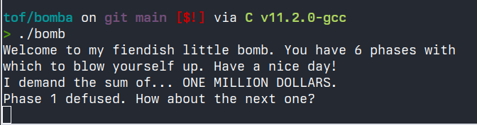

# la bomba - tölvutækni og forritun verkefni 1

## phase_1

byrjaði á því að skoða hvað væri í gangi í fyrstu skipununni, `sub $0x8, %rsp` og sá að þar er verið að taka frá pláss fyrir `%rsp`  
í næstu línu er verið að hliðra því sem er inn í `%rip` um `0x1b3a` og setja útkomuna inn í `%rsi`  
notum núna **gdb** til þess að sjá hvað er í `%rsi`, þá má sjá streng:  
`"I demand the sum of... ONE MILLION DOLLARS."`  
sem í fljótu bragði lítur ekki út fyrir að vera assembly skipun, þannig við reiknum með því að það sé lykilorðið  
keyrum forritið aftur og notum strenginn sem inntak og ... *phase_1* aftengt  


## phase_2

```asm
phase_2
    0x000000000000162b <+0>:  endbr64 
    0x000000000000162f <+4>:  push   %rbp
    0x0000000000001630 <+5>:  push   %rbx
    0x0000000000001631 <+6>:  sub    $0x28,%rsp
    0x0000000000001635 <+10>: mov    %fs:0x28,%rax
    0x000000000000163e <+19>: mov    %rax,0x18(%rsp)
    0x0000000000001643 <+24>: xor    %eax,%eax
    0x0000000000001645 <+26>: mov    %rsp,%rsi
```
í fyrstu línum *phase_2* er verið að búa til stackframe og frumstilla slatta af breytum veit ekki alveg, spáði ekki allt of mikið í það  
skoðum fallið í heild sinni, þá sjáum við strax fallið `<read_six_numbers>`  
> byrjum að grafa eftir það, við vitum að inntakið á að vera sex tölur, en hvaða tölur??  

```asm
    0x0000000000001648 <+29>:	call   0x1c41 <read_six_numbers>    # lesa 6 tölur 
```
hmmm ehv í gangi hérna kíkjum inn í þetta fall

```asm
    0x0000000000001c41 <+0>:  endbr64 
    0x0000000000001c45 <+4>:  sub    $0x8,%rsp    
    # pláss tekið frá, búinn til stackframe?

    0x0000555555555c49 <+8>:  mov    %rsi,%rdx
    # fært gildið í %rsi, inntakið, inn í %rdx

    0x0000555555555c4c <+11>: lea    0x4(%rsi),%rcx
    # sett %rsi[1] inn í %rcx

    0x0000555555555c50 <+15>: lea    0x14(%rsi),%rax
    0x0000555555555c54 <+19>: push   %rax
    # sett %rsi[5] inn í %rax og %rax svo ýtt á hlaðann

    0x0000555555555c55 <+20>: lea    0x10(%rsi),%rax
    0x0000555555555c59 <+24>: push   %rax
    # sama hér og í <+15> nema núna %rsi[4] og %rax aftur ýtt

    0x0000555555555c5a <+25>: lea    0xc(%rsi),%r9
    0x0000555555555c5e <+29>: lea    0x8(%rsi),%r8
    # sama gamla sagan skellum %rsi[3] inn í %r9 og %rsi[2] inn í %r8
    
    0x0000555555555c62 <+33>: lea    0x16ba(%rip),%rsi        # 0x555555557323
    # hérna er verið að krydda almennilega, %rip hliðrað um 0x16ba og sett í %rsi
    # ef við tékkum á gildi %rsi hér í gdb má sjá að þetta er strengurinn "%d %d %d %d %d %d"
    # nú höfum við formið á inntakinu 
    
    0x0000555555555c69 <+40>: mov    $0x0,%eax
    0x0000555555555c6e <+45>: call   0x555555555320 <__isoc99_sscanf@plt>
    0x0000555555555c73 <+50>: add    $0x10,%rsp
    0x0000555555555c77 <+54>: cmp    $0x5,%eax
    0x0000555555555c7a <+57>: jle    0x555555555c81 <read_six_numbers+64>
    0x0000555555555c7c <+59>: add    $0x8,%rsp
    0x0000555555555c80 <+63>: ret
    # restin af kóðanum er svo til að athuga hvort að inntakið uppfylli rétt skilyrði

    0x0000555555555c81 <+64>: call   0x555555555c15 <explode_bomb>
    # og svo auðvitað sprengja hér bara til öryggis :)
```
mikið í gangi í þessu falli en það sem við höfum sérstakan áhuga á `cmp` fallinu og hvað er í gistunum þar  
notum `si` í **gdb** til að fara í línu `+33` og kíkjum á minnisaddressuna sem er tilgreind þar, hún inniheldur strenginn `"%d %d %d %d %d %d"`, þessi strengur er svo borinn saman við útkomuna úr `sscanf`

> nú vitum við að inntakið á að vera 6 tölur skildar að með bili  
> byrjum upp á nýtt og segjum við notum stölurnar 1 2 3 4 5 6


```asm
    0x000000000000164d <+34>:	cmpl   $0x1,(%rsp)                  
    # ef %rsp ekki jafnt og 1, hoppa til 165d

    0x0000000000001651 <+38>:	jne    0x165d <phase_2+50>          
    # kemst hingað ef %rsp, fyrsta stak í %rsp þ.e.a.s., jafnt og 1 
    
    0x0000000000001653 <+40>:	mov    %rsp,%rbp                    
    # færir %rsp inn í %rbp sem er á stackinu
    
    0x0000000000001656 <+43>:	mov    $0x2,%ebx                    
    # frumstillir %ebx sem 2
    
    0x000000000000165b <+48>:	jmp    0x1670 <phase_2+69>          
    # stekkur yfir í 0x1670

    0x000000000000165d <+50>:	call   0x1c15 <explode_bomb>        
    # boom
```
ok núna sjáum við að það er búið að frumstilla eina breytu, `%ebx = 2`, og verið að hoppa til `0x1670` þannig við kíkjum þangað næst, línu fyrir línu
> **ath. að þessi lýsing miðar við fyrstu ýtrun, hinar koma seinna**

```asm
    0x0000000000001670 <+69>:	mov    %ebx,%eax                
    # hér er verið að færa %ebx sem er 2 inn í %eax

    0x0000000000001672 <+71>:	add    0x0(%rbp),%eax           
    # svo bætum við fyrsta gildi í %rbp við %eax

    0x0000000000001675 <+74>:	add    $0x1,%eax                
    # bætum svo einum ofan á það

    0x0000000000001678 <+77>:	cmp    %eax,0x4(%rbp)           
    # tékkum hvort annað gildi í %rbp, inntakinu, sé jafnt og %eax + %rbp[0] + 1

    0x000000000000167b <+80>:	je     0x1664 <phase_2+57>      
    # hoppum til 0x1664 ef uppfyllir efri skilyrðin
    
    0x000000000000167d <+82>:	call   0x1c15 <explode_bomb>   
    # annars bless
```
þessi kóðabútur er meginlykkjan í fallinu, athugum núna hvernig það ákveður hvort það eigi að halda áfram

```asm
    0x0000555555555664 <+57>:	add    $0x4,%rbp                    
    # hendum fyrsta gildi %rbp[0] úr %rbp og setjum %rbp[1] sem fyrsta gildi
    
    0x0000555555555668 <+61>:	add    $0x2,%ebx                    
    # bætum 2 við %ebx, þetta er counter
    
    0x000055555555566b <+64>:	cmp    $0xc,%ebx                    
    # athugum hvort %ebx sé orðið 12, mig grunar að lykkjan sé while(%ebx < 12)

    0x000055555555566e <+67>:	je     0x1684 <phase_2+89>  
    # ef %ebx er orðið 12, hoppum til 0x1684
```
nú erum við búin að finna bæði formúlu sem reiknar tölu sem inntak á að fylgja og hvenær sú formúla á að hætta  
við vitum að fyrsta stak á að vera `1` vegna línunar `cmpl   $0x1,(%rsp)` sem er fyrsta compare í fallinu, notum svo formúluna sem við fundum og athugum hvað uppfyllir `%rbp[1] == %eax + %rbp[0] + 1`  
við *"notuðum"* `1 2 3 4 5 6` sem inntak í fyrstu tilraun en sjáum að það gengur ekki, því ef `%rbp[0] = 1` og `%eax = 2` þá verður `%rbp[1] == 4`  
setjum núna upp töflu sem sýnir hver þessi gildi þurfa að vera á hverju stigi

| # | `%rbp[0]` | `%eax` | `%rbp[1]` | `%eax == 12` |
|:---   |:---:  |:---:  |---:      |:---:  |
|1      |1      |2      |1+2+1=4    |false  |
|2      |4      |4      |4+4+1=9    |false  |
|3      |9      |6      |9+6+1=16   |false  |
|4      |16     |8      |16+8+1=25  |false  |
|5      |25     |10     |25+10+1=36 |false  |
|6      |36     |12     |36+12+1=49 |true   |

þá er lykilorðið bara komið, `1 4 9 16 25 36 49` og í þessum skrifuðu orðum sé ég að mynstrið er `a[i] = (i+1)^2`, rosalega sem hægt er að flækja einfaldan kóða og ég hefði átt að sjá þetta fyrr  
