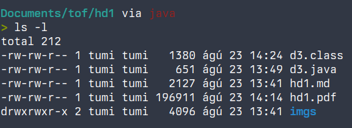

# heimadæmi 1 - tölvutækni ofl.

## spurning 1
- af þessum möguleikum nota ég mest í röð fyrst það sem ég nota mest, það sem ég nefndi ekki nota ég ekki
    1. æfingardæmi
    2. endurskrifun glósa
    3. hóplærdómur
    4. endurlestur

- ég hugsa að fólk stundi þetta ekki mikið vegna hversu vel það er hamrað inn nemendur snemma að páfagaukalærdómur virki ekki og þetta hljómar svipað þrátt fyrir að vera það ekki


## spurning 2
þessi aðferð virðist svínvirka miðað við niðurstöðurnar á mynd 1, stress virðist líka vera minni áhrifaþáttur þegar það kemur að námsárangri útfrá upprifjunarnámi á móti meira hefðbundnu lestrarnámi.

## spurning 3
### a)
kóði:
```java 
public class d3a {
    public static void main(String[] args) {
        System.out.println("int og float: ");

        int a = 50000;
        System.out.println("int 50000*50000 --> " + a * a);

        float b = 1e20f;
        float c = 3.14f;
        System.out.println("float 1e20 + (-1e20 + 3.14) --> " + (b + (-b + c)));
    }
}
```
output:
```
int og float: 
int 50000*50000 --> -1794967296
float 1e20 + (-1e20 + 3.14) --> 0.0
```

<div class="pb"></div>

### b)
kóði:  
```java
public class d3b {
    public static void main(String[] args) {
        System.out.println("long og double: ");

        long d = (long) Math.pow(2, 63);
        System.out.println("long 2⁶³ * 2⁶³ --> " + d * d);

        double e = 1e20;
        double f = 3.14;
        System.out.println("double 1e20 + (-1e20 + 3.14) --> " + (e + (-e + f)));
    }
}
```
output:  
```
long og double: 
long 50000 * 50000 --> 1
double 1e20 + (-1e20 + 3.14) --> 0.0
```

## spurning 4
### a)
það að minnisfjallið hafi fjóra stalla gefur til kynna að minnistigveldið geti tekið við fjórum mismunandi stærðum af gögnum

### b)
ef ég skil fjallið rétt þá ættu hámarksafköst að vera 8000gb/s en það hljómar ekki rétt þannig mig grunar að ég skilji fjallið ekki

<div class="pb"></div>

## spurning 5
## a)
ég setti upp linux á vélinni minni í fyrra til að spara mér pening 

## b)
  

