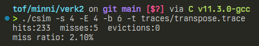
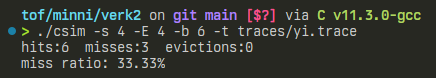
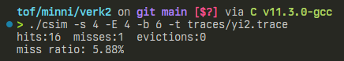

# verkefni 2 - tölvutækni og forritun

## 1.
ég set hér inn allann þann kóða sem ég átti við, set restina af kóðanum neðst í skil

**global breytur og struct:**
```c
/**
 * @brief skilgreining á einni línu í block
 */
typedef struct line
{
    char valid;             /**bita gildi, 0 ef lína ekki lögleg, 1 ef hún er lögleg*/
    mem_addr_t tag;         /**efstu bitar í visfangi línunar*/
    unsigned long long lru; /**teljari sem segir til um hvenær þessi lína var síðust notuð*/
} Line;

typedef Line *Set;  /**skilgreining á set, fylki af línum*/
typedef Set *Cache; /**skilgreining á skyndiminninu, fylki af mengjum*/
Cache cache;        /**global breyta cache*/
```

**initCache**
```c
void initCache()
{
    // frumstilla skyndiminni sem fylki af mengjum
    cache = (Set *)malloc(sizeof(Set *) * S);

    // lykkja yfir skyndiminnið til að frumstilla mengin
    for (int i = 0; i < S; i++)
    {
        cache[i] = (Line *)malloc(sizeof(Line *) * B);
        for (int j = 0; j < E; j++)
        {
            // frumstilla gögin fyrir hverja línu
            cache[i][j].valid = 0;
            cache[i][j].tag = 0;
            cache[i][j].lru = 0;
        }
    }
}
```

**freeCache**
```c
void freeCache()
{
    // segir sig pínu sjálft
    // fer í gegnum öll mengi skyndiminnisins og hreinsar það minnisfang
    for (int i = 0; i < S; i++)
    {
        free(cache[i]);
    }
    // endar á að hreinsa skyndiminnið skjálft
    free(cache);
}
```

**accessData**
```c
void accessData(mem_addr_t addr)
{
    // temp lru gildi sett sem stærsta gildi á int
    // síðan lykkjað yfir öll lru gildi í cachinu og minnsta fundið
    long int shortest_lru = ULONG_MAX;
    int CLlru; /**current longest lru*/

    // sett vísun á viðeigandi stað í skyndiminni
    // hliðrað til hægri um línustærð og logical & 
    // við stærð skyndiminnis til að fá viðeigandi minnisfang
    mem_addr_t setI = addr >> b & (mem_addr_t)(S - 1);

    // passað að taggið sé á sama formi og Line.tag
    mem_addr_t tag = addr >> (s + b);
    Set setInUse = cache[setI];

    for (int i = 0; i < E; ++i)
    {
        if (setInUse[i].valid)
        {
            if (setInUse[i].tag == tag)
            {
                setInUse[i].lru = lru_counter++;
                hit_count++;
                return;
            }
        }

        // gott að nota bara sömu lykkju til að gera tvo alveg mismunandi hluti
        // það eykur performance :) :)
        if (setInUse[i].lru < shortest_lru)
        {
            shortest_lru = setInUse[i].lru;
            CLlru = i;
        }
    }

    miss_count++;

    if (setInUse[CLlru].valid)
    {
        eviction_count++;
    }
    setInUse[CLlru].valid = 1;
    setInUse[CLlru].lru = lru_counter++;
    setInUse[CLlru].tag = tag;
}
```

### 1. keyrslur

> til að herma 4-vítt skyndiminni með 64 bæta línu og 16 mengjum þurfum við fyrst að finna `s` þar sem $16 = 2^s$ og `b` þar sem $64 = 2^b$  
> þetta er ekki mjög flókinn reikningur þannig nenni ekki að sýna hann en `s=4` og `b=6`

**transpose.trace**  


**yi.trace**  


**yi2.trace**  


## 2.
