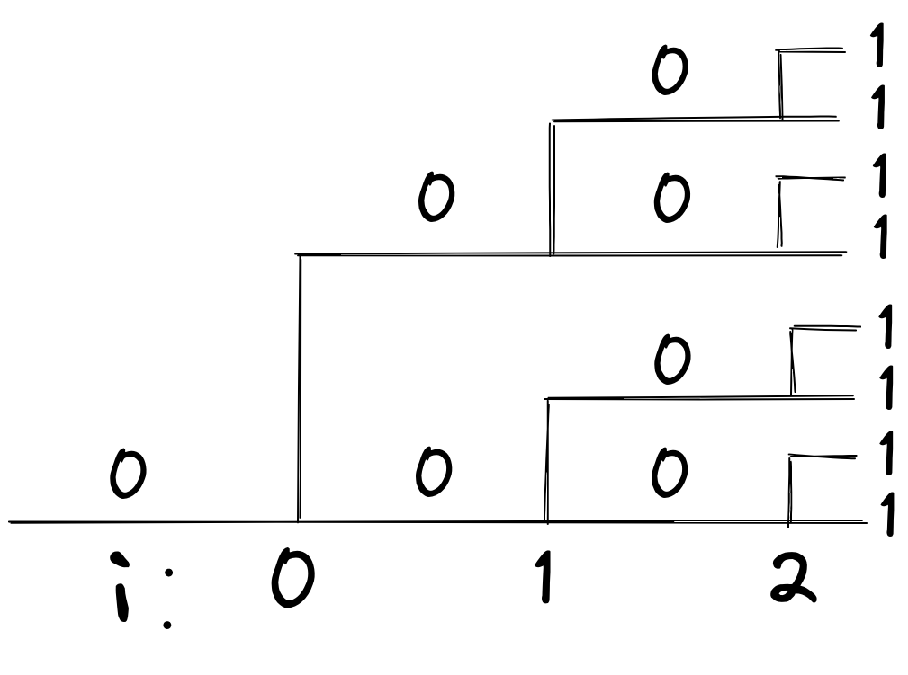
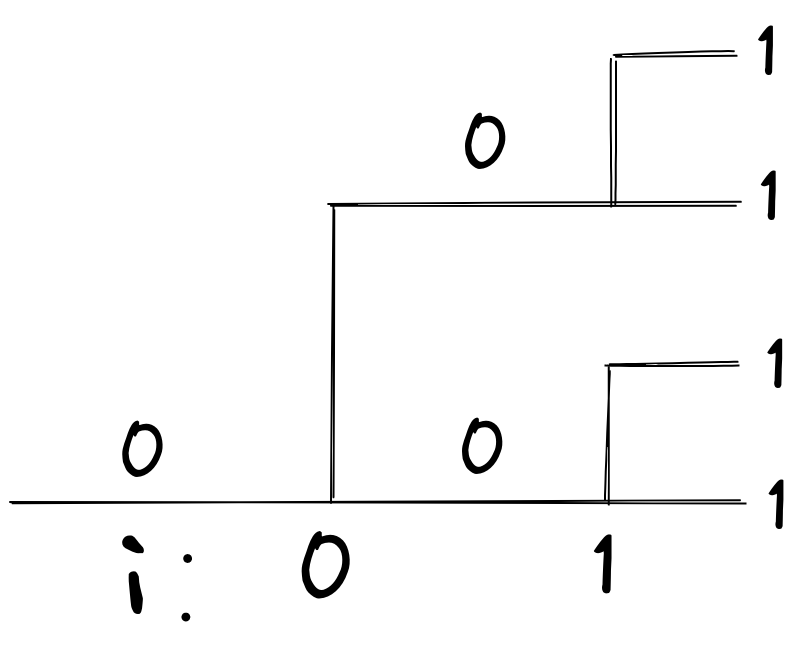
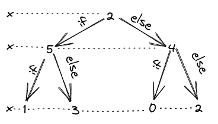
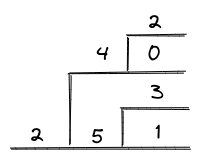

# heimadæmi 11 - tölvutækni og forritun

## 1.
### a)
það prentast út 7 0-tákn og 8 1-tákn, það má sjá það með því að keyra skránna eða með því að teikna fork tréð, sjá mynd:  

### b)
ef við skoðum myndina og fjölda tákna þá sjáum við fljótt að við erum með $2^3=8$ 1-tákn og $2^3-1=7$ 0-tákn  
þá höfum við frekar góða hugmynd um formúluna, 1-tákn væru $2^k$ mörg og 0-tákn $2^k-1$ mörg, við getum tékkað á þessu með því að skoða myndina eftir að við tökum út síðasta forkið, það væri eins og break condition væri `i<2` og þá fáum við 4 1-tákn og 3 0-tákn sem uppfyllir skilyrðin okkar, sjá mynd:  

## 2. 
### a)  
teiknaði bæði binary tré, finnst auðveldara að sjá það fyrir, og ferlarit, finnst auðveldara að lesa út úr  
sjá myndir:  

| tré | ferlarit |
|:---:|:---:|
|||

### b)
1. `5 1 3 4 0 2`
2. `4 0 2 5 1 3`
3. `5 3 1 4 2 0`

### c)
já það væri hægt, þar sem hægt er að fara úr öllum þeim stöðum í ferlaritinu sem hafa foreldri sem hefur keyrt væri hægt að fylgja röðinni og fá `5 4 3 2 1 0`

## 3.
### a)
einfalt dæmi væri forrit sem reynir að sækja gögn af neti en af einhverjum ástæðium nær ekki sambandi við netþjón, um að gera að prófa aftur einu sinni eða tvisvar 

### b)
forrit sem reynir að deila með núlli

### c)
1. það þarf að v[label](https://ugla.hi.is/)ista gistin, þau halda upplýingum sem notuð verða annarstaðar
2. þar sem L1 er skyndiminni þarf ekki að vista það, hinsvegar er geymd vísun á stað til að finna L1 aftur
3. TLB er eins og L1

### d)
afkomandi fær:
- sjálfstætt afrit af vistfangsrými foreldrisins
- afrit af öllum opnum skrárbendum foreldrisins

## 4.
### a)
okidoki ég er með sýndarvistfangið `0x073B`  
byrjum á að finna `VPN` og `VPO` með því að þýða sýndarvistfangið yfir í 14 bita tvíundartölu: `00011100111011`  
þá er `VPN` fyrstu 8 tölurnar frá vinstri og `VPO` restin, raungildin á `VPN` og `VPO` væru þá `1C` og `3B`  
splittum núna bitastrengum en fremur upp og finnum `TLBT` og `TLBI`, gildin á þeim verða `7` og `0`  
nýtum svo `TLBT` og `TLBI` til að flett upp gildi á `PPN` í töflunni, gildið er `2`  
`PPO` er svo auðvelt að finna vegna þess að það er bara það sama og `VPO`, semsagt `3B`  
grömsum nú í þessum bitastreng og fáum `CI` og `CO`, gildin á þeim eru `E` og `3`
flettum nú upp í seinni töflunni, við erum að leita að `ldx = E`, þar er `CT` jafnt og `13` og þar sem `CO` er `3` þá er bætið okkar `D3` :) :)

|| VPN | VPO | TLBT | TLBI | PPN | PPO | CT  | CI  | CO  |
|:-| :-: | :-: | :--: | :--: | :-: | :-: | :-: | :-: | :-: |
|binary|`00011100`|`111011`|`000111`|`00`|`000010`|`111011`|`000010`|`1110`|`11`|
|hex|`1C`|`3B`|`7`|`0`|`02`|`3B`|`2`|`E`|`3`|

### b)
búum til vistfang sem uppfyllir smell í **TLB** og skell í **skyndiminni**  
einu **TLBT** og **TLBI** sem gera smell eru í töflunni fyrir neðan
| tag | set | binary   |
|:---:|:---:|:--------:|
| 03  | 1   | 00001101 |
| 09  | 0   | 00100100 |
| 03  | 3   | 00001111 |
| 0A  | 3   | 00101011 | 
| 07  | 0   | 00011100 |

svo í töflunni hér fyrir neðan eru þau gildi sem skila skell 
| tag | idx | binary |
|:---:|:---:|:------:|
| 15  |1|01 0101 0001| 
| 36  |3|11 0110 0011|
| 31  |6|11 0001 0110|
| 2D  |9|10 1101 1001|
| 0B  |B|00 1011 1011|
| 12  |C|01 0010 1100|
| 14  |F|01 0100 1111|