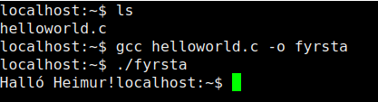

# heimadæmi 2 - tölvutækni og forritun
## 1. 


## 2.
með engum breytingum keyrir forritið með `0 <= i < 6`

### a)
við fyrstu breytingar, að bæta `double x` fyrir framan `a`, keyrir forritið ekki með `i > 3` sem ég held að þýði `x` sé í raun að minnka plássið sem i hefur um ehv örlítið

### b)
við aðrar breytingar, að bæta `double x` fyrir aftan `d` keyrir forritið eins og með engum breytingum   
þetta er vegna þess að plássið sem `i` tekur frá hefur engin áhrif á plássið sem `x` tekur frá þar sem það verður alltaf árekstur á `d` áður en það verður árekstur á `x`

### c)
við þriðju breytingar, að breyta `a` úr 2 staka fylki yfir í 8 staka fylki, bjóst ég við villu þegar `i = 12`, þe. eftir sama bil og í fyrsta dæminu, en villan kom upp við `i = 10`   
það sem ég held að sé í gangi hér er að plássið sem `a` hafði var stækkað en líka betur fyllt af `a` og þessvegna flæðir yfir fyrr á ferli `i`


## 3.
### a)
lokagildi bæði `i` og `p` er það sama vegna þess að `i` er frumstillt sem `2` en síðan er `p` frumstillt sem pointer á minnis-adressuna hjá `i`, `*` skilgreinir pointer og `&` address, og síðan er `*p` breytt sem gerir það að verkum að gildið í minninu `&i` breytist og bæði `i` og `p` enda sem `5`

### b)
í fyrra dæminu þyrfti `q` að vera mem adressa á integer, veit ekki alveg hvernig, eða yfirhöfuð hvort, það ætti að útfæra það  
í seinna dæminu þyrftu bæði `q` og `p` að vera af sömu týpu en `q` þyrfti að vísa í minnið, held ég??

## 4.
hér er forritið, fyrsta útgáfa keyrði for-lykkjuna upp að `k` en það dróg rosalega úr performance svo breytti yfir í $\sqrt{k}$ 

```C
#include <stdio.h>
#include <stdlib.h>
#include <math.h>

int isprime(long k)
{
    double not_top = sqrt((double)k);
    int top = (int)not_top;
    if (k <= 2)
        return 0;
    for (int i = 3; i <= top; i += 2)
    {
        if (k % i == 0)
            return 0;
    }

    return (1);
}

int main(int argc, char *argv[])
{
    int n = argc == 2 ? atoi(argv[1]) : 5;
    int cnt = 0;
    int i = 3;
    int a, b;
    while (cnt < n)
    {
        if (isprime(i) && isprime(i + 2))
        {
            printf("%i og %i\n", i, i + 2);
            cnt++;
        }
        i += 2;
    }
}
```
output fyrir `n=10`
```
./twinpr 10  
3 og 5  
5 og 7  
11 og 13  
17 og 19  
29 og 31  
41 og 43  
59 og 61  
71 og 73  
101 og 103  
107 og 109  
```

## 5.
forritið:
```c
struct Node *delNode(struct Node *head, int k)
{
    struct Node *p, *q;
    if (k == 1 && head->next != NULL)
    {
        head = head->next;
        return head;
    };

    p = head;
    q = p->next;
    int i;
    for (i = 1; i < k; i++)
    {
        // printf("%i: %i, %i \n", i, p->data,q->data);
        if (q->next != NULL)
        {
            p = q;
            q = q->next;
        }
        else
            break;
    }
    if (i == k && p->next->next != NULL)
    {
        p->next = p->next->next;
        free(q);
    }

    return head;
}
```

```c
tof/v2/progs on git main [$x!?] via C v9.4.0-gcc via py v3.8.10 
x ./lilis
Listi: 21 -> 49 -> 92 -> 86 -> 35 -> 93 -> 15 -> 77 -> 86 -> 83
Listi: 49 -> 92 -> 86 -> 35 -> 93 -> 15 -> 77 -> 86 -> 83
Listi: 49 -> 92 -> 86 -> 93 -> 15 -> 77 -> 86 -> 83
Listi: 49 -> 92 -> 86 -> 93 -> 15 -> 77 -> 86 -> 83
```