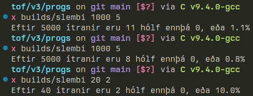
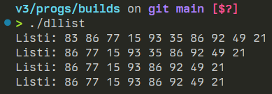

# heimadæmi 3 - tölvutækni og forritun

## 1.
okok ef `p` og `q` eru bendar á heiltölur, `int*`, eru þá eftirfarandi dæmi möguleg?

`(p == q && p* != q*)`  
þe. getur `p` verið jafnt og `q` án þess að `p*` jafnt og `q*` sé satt?  
nei, það að `p == q` þýðir að báðir bendar benda á sama minnissvæði og sama minnissvæði getur ekki verið mismunandi gildi  
þannig ef `p == q` þá verður `*p == *q` að vera satt  

*hinsvegar* getur andstæðan verið sönn  
þar sem mismunandi minnissvæði geta haldið sömu upplýsingunum þá geta tveir mismunandi bendar bent á tvö mismunandi svæði þannig `p != q` en gildin á þessum svæðum eru samt þau sömu þannig `*p == *q`  

örlítill kóði sem ég notaði til þess að skilja þetta:
```c
int x = 10;
int y = 10;
int *p = &x;
int *q = &y;

printf("x: %d, p: %p, q: %p \n", x, p, q);
printf("*p: %i, *q: %i \n", *p, *q);
printf("p == q: %d, *p == *q: %d", p == q, *p == *q);
```

output:  
```
x: 10, p: 0x7ffc4a12c4c0, q: 0x7ffc4a12c4c4 
*p: 10, *q: 10 
p == q: 0, *p == *q: 1
```

## 2.
skemmtilegt dæmi, set fyrst kóðabútinn og svo 3 keyrslur þar af tvær með sömu parametrum  

```c
#include <stdio.h>
#include <stdlib.h>
#include <time.h>

int main(int argc, char *argv[])
{
    srand(time(0));

    int n = 500, k = 4;
    if (argc > 2)
    {
        n = atoi(argv[1]);
        k = atoi(argv[2]);
    }

    int *a = (int *)calloc(n, sizeof(int));
    for (int i = 0; i < k * n; i++)
    {
        int r = rand() % n;
        a[r]++;
    }

    int cnt = 0;
    for (int i = 0; i < n; i++)
    {
        if (a[i] == 0)
            cnt++;
    }
    free(a);

    printf("Eftir %i ítranir eru %i hólf ennþá 0, eða %.1f%%",
           (int)k * n, cnt, ((double)cnt / (double)n) * 100);
}
```  

keyrslur:  



## 3. 
forrit:  
```c
/* Eyðir hnúti númer k í tvítengda listanum sem h og t benda á.
   Breytir mögulega haus- og halabendunum h og t               */
void delNode(struct dNode **h, struct dNode **t, int k)
{
    struct dNode *p, *q, *f;
    if (k == 1 && (*h)->next != NULL)
    {
        p = (*h)->next;
        p->prev = NULL;
        free((*h));
        (*h) = p;
        return;
    }

    int i = 0;
    p = (*h);
    q = (*h)->next;
    f = (*h)->next->next;
    for (i; i < k; i++) {
        if (f != NULL && f->next != NULL) {
            f = f->next;
            q = f->prev;
            p = q->prev;
        } else if (f != NULL) {
            q = f;
            p = q->prev;
            f = NULL;
        } else break;
    }

    if (i == k) {
        if (f != NULL) {
            p->next = q->next;
            f->prev = q->prev;
        } else {
            p->next = NULL;
            (*t) = p;
        }
        free(q);
    }
}
```  

keyrsla:  
