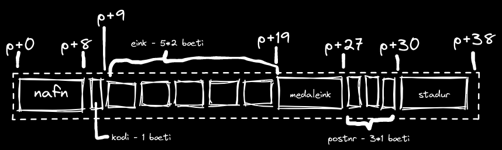
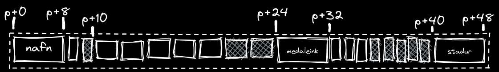
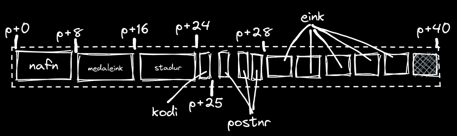
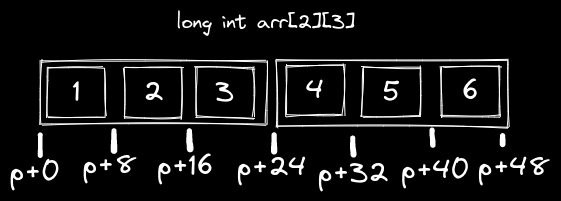

---
pdf_options:
  format: a4
  margin: 10mm 20mm
---
# heimadæmi 8 - tölvutækni og forritun
þorvaldur tumi baldursson
---

## 1.
### a)

ef við brjótum þetta struct upp í stærðir hvers viðfangs fáum við töflu sem sýnir stærð óuppraðaðra gagna, ég elska töflur :)

| týpa       | nafn      | bæti | bitar |
| :--------- | :-------- | :--- | :---- |
| char*      | nafn      | 8    | 64    |
| char       | kodi      | 1    | 4     |
| short\[5\] | eink      | 2\*5 | 8\*5  |
| double     | medaleink | 8    | 64    |
| char\[3\]  | postnr    | 3\*1 | 3\*4  |
| char*      | stadur    | 8    | 64    |

> skipting fyrir nokkra víkkun: [8][1][5\*2][8][3\*1][8]  



þar sem færslan inniheldur float verður `K = 8` og við sjáum greinilega á myndinni að við erum ekki að uppfylla þá reglu  
eina skiptið sem við fylgjum reglunni er í `p+0` og eftir `nafn`  
lögum þetta með því að:
-  víkka `kodi` um `1` bæti 
-  víkka `eink` um `4` bæti
-  víkka `postnr` um `5` bæti

nú má sjá á myndinni að skiptingin uppfyllir `K=8`



### b)
heildarstærð gagnanna án nokkurrar víkkunnar eru `38` bæti, minnsta tala á eftir `38` sem gengur upp í `8` er `40` þannig spurning um að reyna víkka hluti bara um `2` bæti

byrjum á að hópa saman allar stóru breyturnar fremst, þe. `nafn`, `medaleink` og `stadur`  
skoðum svo restina, við erum til dæmis með `1`, `kodi`, og `3`, `postnr`, chars, ef við hópum þá saman erum við með gildi sem gengur upp í `4`  
þá er bara eftir `eink`, við víkkum það um `2` bæti, þá er komið `40` bæta færslu sem uppfyllir `k=8`  
sjá mynd  


## 2.
förum í gegn um assembly kóðann, línu fyrir línu:  
```asm
afrit:
  movslq  %edi, %rdi          # %rdi = i
  movslq  %esi, %rsi          # %rsi = j
  leaq    0(,%rsi,8), %rax    # setjum gildið 8*%rsi inn í %rax
  subq    %rsi, %rax          # drögum %rsi frá %rax, núna 7*j
```

> mig grunar hvernig þetta virkar, hér erum við að margfalda j með 7  
> þar sem fylki eru í raun bara raðir af gildum á minni er hægt að gera ráð fyrir því að fyrra stakið fylkisinntakinu, þe. N í b, sé margfeldi af lengd innri staka fylkisins

```asm
  addq    %rdi, %rax          # leggjum %rdi við %rax, núna 7*j+i
  movq    b(,%rax,8), %rdx    # færum inn í stak 8(7*j+i) úr b inn í %rdx
  leaq    (%rdi,%rdi,4), %rax # endurstillum %rax með 5*j
  leaq    (%rdi,%rax,2), %rax # yfirskrifum það svo með 11*j
  addq    %rax, %rsi          # bætum 11*j við i, þá erum við með 11*j+i
  movq    %rdx, a(,%rsi,8)    # færum stak b[7*j+1] inn í a[11*j+i]
  ret
```

### a)
útfrá pælingunum mínum fyrir ofan sé ég að `M=7` og `N=11`  
þessar tölur, eins og ég nefni fyrir ofan, eru hliðrun um lengd innri fylkja tvívíðu fylkjanna í vísunum fyrir stök sjá mynd,
þar erum við með tvívítt fylki með lengdir `2,3` nú sjáum við að ef við notum formúluna `*arr + 8*(3*i+j)` til að finna stak `arr[i][j]` gengur það upp. 
segjum að við viljum finna `arr[1][2]` setjum þá tölurnar inn í formúluna og fáum `*arr + 8*(3*1+2)` sem er jafnt og `*arr + 40` sem gefur stakið `6` sem er rétt




### b)
ef bæði fylkin hefðu verið skilgreind sem `MxN` þá hefði ekki þurft að reikna staðsetningar innan annarshvors fylkisins sérstaklega og þá hefði ekki verið hægt að finna `N` en það hefði verið hægt að finna `M` á sama hátt og fyrir ofan

## 3.
skoðum fyrst assembly dumpið í heild sinni, ef við leitum að kanarífuglinum getum við fljótt séð að hann er að finna í línu 8 í `echo` fallinu sjá  
```asm
	movq	%fs:40, %rax
	movq	%rax, 8(%rsp)
  xorl	%eax, %eax
```
eftir nokkrar keyrslur er hægt að sjá að gildið er handahófskennt fyrir hverja keyrslu, þetta kemur í veg fyrir að hægt sé að læra regluna sem kanarífuglinn fylgir og setja inntak sem uppfyllir hana til að fara framhjá fuglinum

## 4. 
### a)
minnisaðgananga í assembly er hægt að finna með því að leita að vísunum í gisti með svigum utan um gistanafnið t.d. `(%rdx)`  
kíkjum núna á smalamálshauginn (assembly dump) og merkjum við alla minnisaðganga:  
```asm
sumv:
  .LFB0:
    movq	$0, (%rdx)
    testl	%esi, %esi
    jle	.L1
    movq	%rdi, %rax
    leal	-1(%rsi), %ecx
    leaq	8(%rdi,%rcx,8), %rsi
  .L3:
    movq	(%rax), %rcx    # hér er minnisaðgangur 1
    addq	%rcx, (%rdx)    # nr. 2
    addq	$8, %rax
    cmpq	%rsi, %rax
    jne	.L3
  .L1:
    ret
```
hér eru tveir minnisaðgangar eins og hægt væri að sjá útfrá c kóðanum, `\s` og `a[i]`

### b)  
einfaldasta leiðin til að minnka minnisaðganga er einfaldlega að hafa bara einn minnisaðgang inn í `*s` eftir að allt í `a` hefur verið lagt saman, sjá:  

```c
void sumvBetter(long *a, int len, long *s) {
  int i;
  long temp;
  for (i=0; i<len; i++) {
    temp += a[i];
  }
  *s = temp;
}
```

## 5.
### a)
smalamálskóðinn sem kemur út tekur lykkjuna og breytir henni í röð af skipunum í stað þess að vera lykkja, það er bara kallað á `addq` með viðeigandi hliðrun á vistfang `a` 10 sinnum

### b)
núna beitir þýðandinn aftur mjög svipuðum aðferðum með breytingunni að setja allt heila klabbið inn í lykkju sem er kallað á tvisvar, þ.e. leggur fyrstur 10 stökin saman inn með 10 aðgerðum í fyrstu ýtrun og síðan er hliðrað stakinu sem notað er til að hliðra bendi á vistfang fylkisins um `8*20` bæti og lykkjan keyrð aftur

### c)
hérna er fyrst, utan nokkurar lykkju, bætt lagt fyrstu 3 stök fylkisins saman og síðan, innan lykkju, er lagt við næstu 8 stök fylkisins og kallað á lykkjuna aftur með hliðrun um `64` bæti