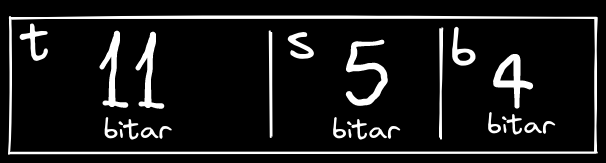

# heimadæmi 9 - tölvutækni og forritun

## 1.

| tegund|verð/Tb | orkunotkun read / write | SRW | max-g | MBTF |
|---|---|---|---|---|---|
| samsung | 14250 kr/TB | 2.1 W / 2.3 W | 560 MB/s / 530 MB/s | 1500g | 1.5 milljón klst. |
| WDR | 5990 kr/TB | 3.3 W / 3.3 W | 150 MB/s / 150 MB/s | 250g | 1 milljón klst. | 

## 2.
> stærð = vídd * mengi * blocksize  

í þessu dæmi lítur skiptingin á tölvukerfinu svona út:  
|skyndiminni (R)|línustærð (B)|mengi (S)| vídd (E)|
|:---:|:---:|:---:|:---:|
|2048 bæti|16 bæti|#32|?|

### a)
vídd skyndiminnis er hægt að finna með formúlunni $E = \frac{R}{B * S}$ svo í þessu tilfelli væri víddin jafnt og $\frac{2048}{16*32}=4$

### b) 
til að finna skiptingu vistfanga notum við gildin í skiptingu á tölvukerfinu  
það sem við þurfum að skoða er mengin, `(S)`, og línustærð, `(B)`.
við getum byrjað á að skella línustærðinni inn fyrir block offset, við finnum gildið á block offset með því að taka veldisvísinn á gildi `B` í tvíundarformi þe. $16 = 2^4$ þá verður  
við gerum það sama með `S` og finnum `s` þar sem $S = 2^s$, í þessu tilfelli er það `5`  
síðan finnum við stærð á `t` með því að fylla upp í restina þá er skiptingin eins og sjá má á myndinni fyrir neðan  

### C)
ef við brjótum þessa hex tölu upp í binary getum við skipt henni niður á vistföng `0000-1011-0001-1110-0100` setjum nú upp töflu þar sem hægt er að skoða skiptinguna

|binary|`00001011000`|`11110`|`0100`|
|:---:|:---:|:---:|:---:|
|vistfang|t|s|b|
|hex gildi|0x58|0x1E|0x4|
|dec gildi|88|30|4|

við getum þá gengið útfrá því að gögnin byrji eftir 4 bita hliðrun þar sem `b = 4`